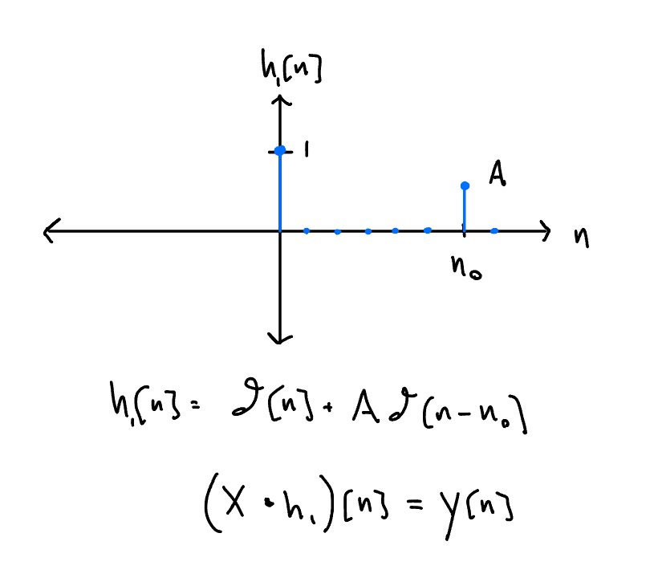
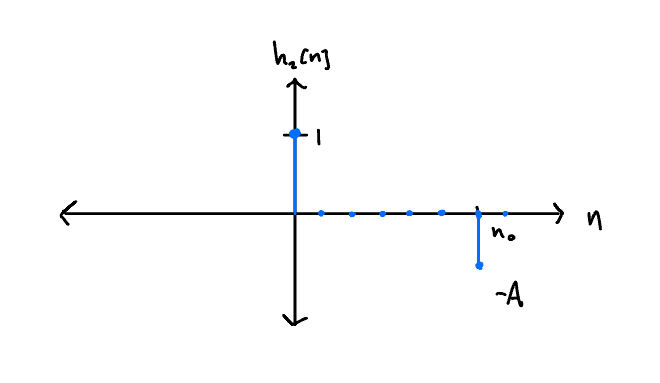
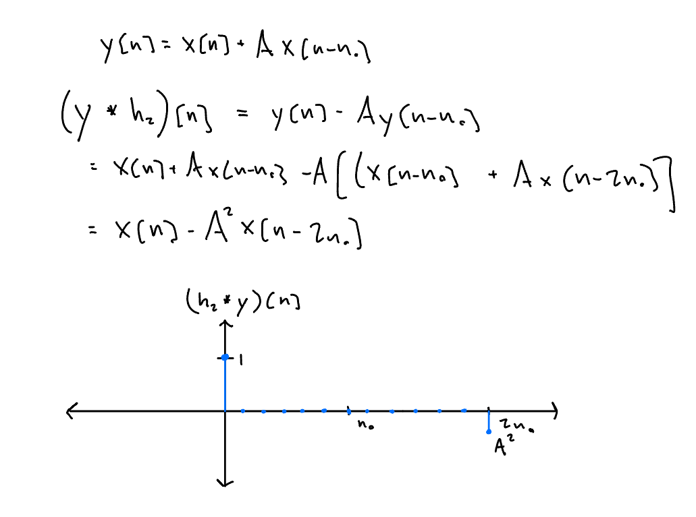
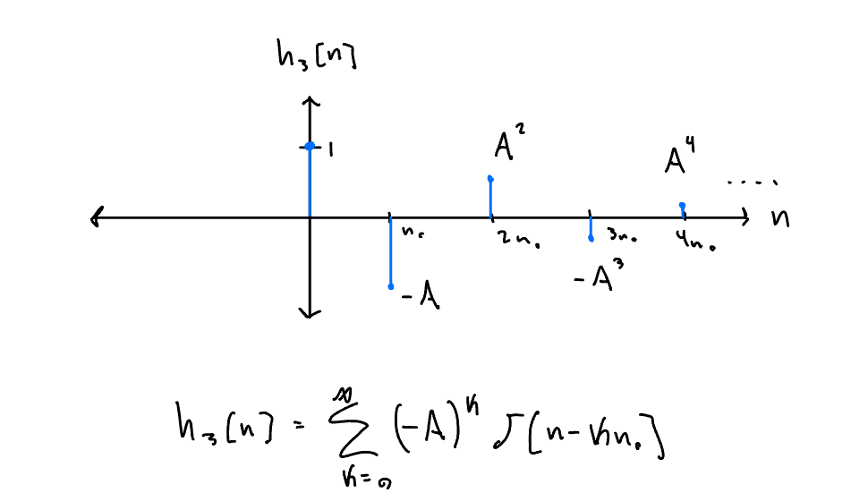
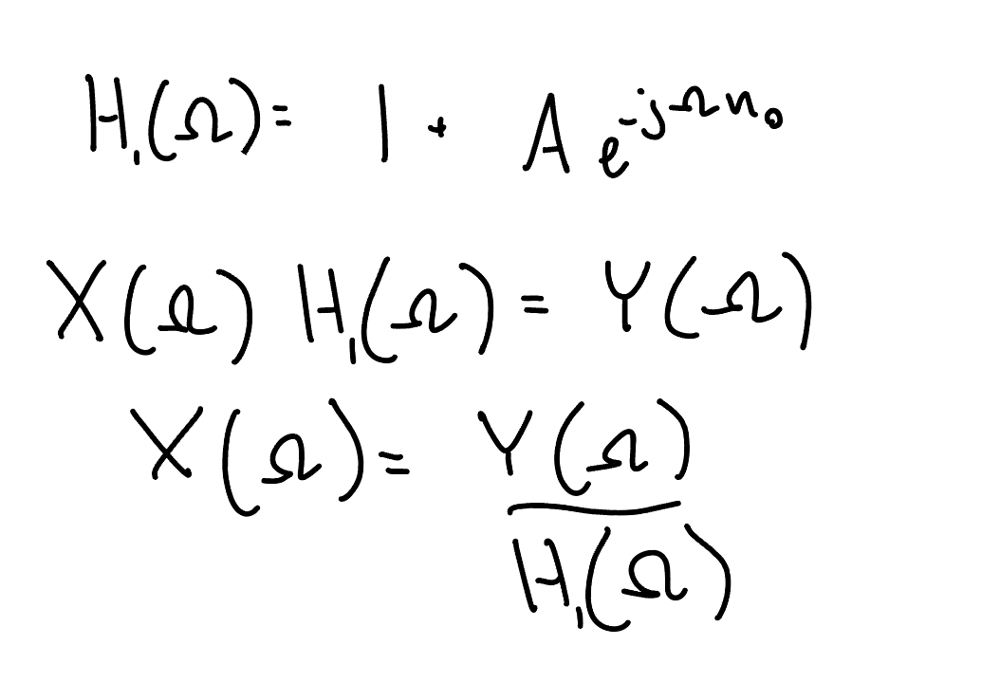

Overview
--
This project investigates echo removal in discrete-time audio signals using
both time-domain and frequency-domain techniques. An echo chamber is modeled
as a linear time-invariant system with delayed feedback. We derive an ideal
inverse filter, study its stability, and implement practical finite-length
approximations in Python.


Problem Setup
--

An **echo chamber** can be modeled as a **discrete-time linear system** with **unit sample response**:


This means the output of the system is the **original signal plus a delayed, scaled copy**:


Where `*` denotes **convolution**.


Our goal is to extraxt the orignal signal x[n] from the echoed signal y[n]

Time Domain Approach
--
We attempt to remove the echo with a filter such as :



However this introduces an echo at 2n_0



We could try to cancel this additional echo out but we would need to use a filter of infinite length.



We can approxamte this and get a pretty good echo-free signal

```python
def causal_convolution(x, y):
    """
    Compute the causal discrete-time convolution of two 1D sequences.

    This function implements linear convolution directly in the time domain
    using nested loops, assuming both input sequences are causal
    (i.e., zero for negative indices).

    Parameters
    ----------
    x : array-like
        First input sequence (e.g., impulse response).
    y : array-like
        Second input sequence (e.g., input signal).

    Returns
    -------
    out : list
        The linear convolution of x and y, with length len(x) + len(y).

    """
    out = [0] * (len(x) + len(y))
    for i in range(len(x)):
        for j in range(len(y)):
            out[i + j] += y[j] * x[i]
    return out


def create_kernel_N_non_zeroes(N, A, n_0):
    """
    Construct a truncated echo-canceling impulse response.

    The impulse response consists of N nonzero samples spaced by n_0,
    with alternating signs and exponentially decaying amplitude:

        h[n] = sum_{k=0}^{N-1} (-A)^k delta[n - k n_0]

    Parameters
    ----------
    N : int
        Number of nonzero taps in the impulse response.
    A : float
        Echo attenuation factor (|A| < 1 for stability).
    n_0 : int
        Echo delay in samples.

    Returns
    -------
    out : list
        A discrete-time impulse response containing N nonzero samples.

    Notes
    -----
    This is a finite-length approximation of the ideal infinite impulse
    response used for echo cancellation.
    """
    out = [0] * ((N - 1) * n_0 + 1)
    for i in range(N):
        out[i * n_0] = ((-1) ** i) * (A ** i)
    return out

def remove_echo(N,sample):
    """
    Remove echo from an audio signal using time-domain convolution.

    This function constructs a truncated echo-canceling filter and
    convolves it with the input signal to suppress echoes.

    Parameters
    ----------
    N : int
        Number of nonzero taps used in the echo-canceling filter.
    sample : array-like
        Input audio signal containing echo.

    Returns
    -------
    None
        The echo-reduced signal is written to a WAV file.
    """
    h_N = create_kernel_N_non_zeroes(N,A,n_0)
    conv = causal_convolution(h_N,sample)
    name = f"first_{N}_non_zero.wav"
    wavfile.write(conv, fs, name)

```
Frequency Domain Approach
--
A more complete approach is viewing this problem in the frequency domain.

From our original impulse response of the echo chamber, we can find the frequency response H(omega).



We can then find X(Omega) as convolution in time is multiplication in frequency.

We can verify our solution with filter h3[n] works as we get the same answer


And in python:

```Python
Y = np.fft.fft(y)
N = len(Y)
Omega = 2 * np.pi * np.arange(N) / N
H = 1 / (1 + A * np.exp(-1j * Omega * n_0))
X = Y * H
x = np.fft.ifft(X)
```
