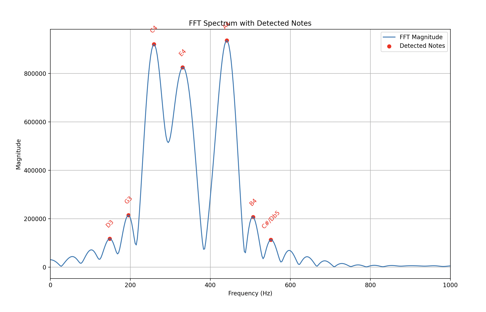

# Identifying Musical Chords Using FFT

This project identifies the musical notes present in audio recordings of chords using frequency-domain analysis. The core idea is to apply the Fast Fourier Transform (FFT) to `.wav` files, detect dominant frequencies, and map those frequencies to the nearest musical notes.


## Overview

A musical chord consists of multiple notes played simultaneously. Each note corresponds to a fundamental frequency. By transforming the time-domain audio signal into the frequency domain, we can identify these frequencies and infer the notes that form the chord.

This repository handles two cases:
- **Long-duration chords** (clear spectral peaks)
- **Short-duration chords** (challenging due to poor frequency resolution)


## Methodology

### 1. Read Audio Data
Audio files are read using `scipy.io.wavfile`, yielding the sampling rate and waveform.

```python
from scipy.io import wavfile

fs, signal = wavfile.read("short3.wav")

```

### 2. FFT Analysis

For long signals, a standard FFT is sufficient.
For short-duration chords, the signal is zero-padded to improve frequency resolution:
```python
N_fft = 4000
signal_padded = np.zeros(N_fft)
signal_padded[:len(signal)] = signal

fft_values = np.fft.fft(signal_padded)
fft_magnitude = np.abs(fft_values[:N_fft // 2])
```
Zero-padding does not add information, but it interpolates the FFT, making peak detection more reliable.


### 3. Peak Detection


Dominant frequencies are extracted using peak detection:


from scipy.signal import find_peaks
```python
peaks, _ = find_peaks(
    fft_magnitude,
    height=0.1 * np.max(fft_magnitude),
    distance=5
)
frequencies = peaks * (fs / N_fft)
```


### 4. Note Identification

Detected frequencies are mapped to the nearest known musical note using a predefined frequency table (octaves 2–5):

```python
idx = np.argmin(np.abs(all_freqs - detected_frequency))
note = all_notes[idx]
```

Duplicate notes are removed to obtain the final chord.

Example Output
--

Below is an example FFT magnitude spectrum for a short chord, with detected notes highlighted:



Limitations & Improvements
--
Short-duration signals suffer from poor frequency resolution due to the time–frequency tradeoff.

Possible improvements:

Apply a window function (Hann or Hamming) before FFT

Use STFT or spectrogram-based averaging

Increase robustness using harmonic grouping

Use parabolic interpolation around FFT peaks
