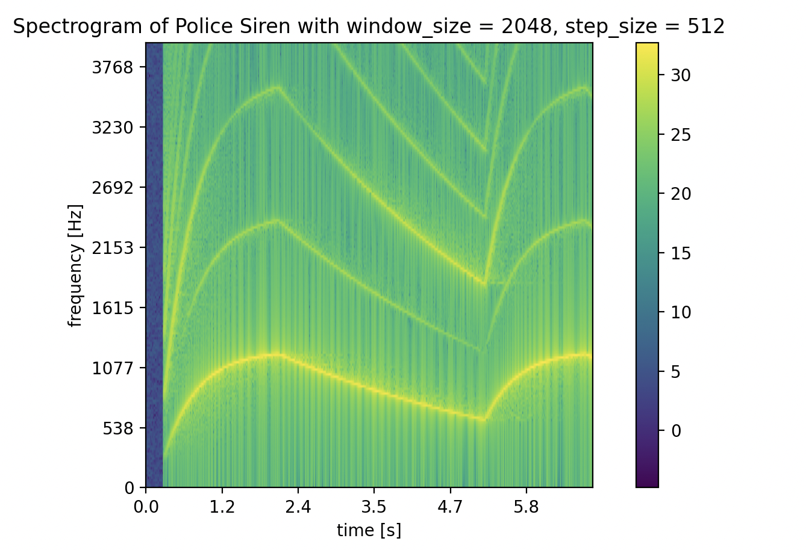

# Short-Time Fourier Transform (STFT) and Spectrogram Visualization

This project implements a **Short-Time Fourier Transform (STFT)** to analyze time-varying frequency content in audio signals. The resulting **spectrogram** allows us to visualize how frequencies evolve over time, which is particularly useful for analyzing sounds like musical instruments, sirens, or speech.

## Overview

The Short-Time Fourier Transform (STFT) breaks a signal into overlapping windows and computes the Fourier Transform of each segment. This provides a **time-frequency representation** of the signal. This repository implements:

- STFT computation with rectangular or Hann windows
- Conversion between frequency bins and Hz
- Conversion between STFT frame indices and real-world time
- Spectrogram computation (magnitude squared of STFT coefficients)
- Visualization with **logarithmic amplitude scaling**


## Usage

### 1. Load Audio and Convert to Mono

```python
from scipy.io import wavfile
import numpy as np

fs, samples = wavfile.read("police.wav")

# Convert stereo to mono if necessary
if samples.ndim == 2:
    samples = samples.mean(axis=1)
```

### 2. Compute STFT
```python
def stft(x, window_size, step_size, window_type='rect'):
    output = []
    if window_type == 'hann':
        window = np.hanning(window_size)
    else:
        window = np.ones(window_size)  # Rectangular window
    for i in range(0, len(x), step_size):
        segment = x[i:i+window_size]
        if len(segment) < window_size:
            break
        segment = segment * window
        output.append(np.fft.fft(segment))
    return output
```

### 3. Helper Functions for Frequency and Time Mapping
```python
def k_to_hz(k, window_size, sample_rate):
    return k*sample_rate/window_size

def hz_to_k(freq, window_size, sample_rate):
    return round(freq*window_size/sample_rate)

def timestep_to_seconds(i, window_size, step_size, sample_rate):
    time_seconds = (i * step_size + window_size / 2) / sample_rate
    return round(time_seconds, 2)

def transpose(x):
    return [[x[j][i] for j in range(len(x))] for i in range(len(x[0]))]

```
### 4. Compute Spectrogram
```python
def spectrogram(X):
    X_T = transpose(X)
    return [[abs(coeff)**2 for coeff in freq_bin] for freq_bin in X_T]

```

### 5. Plot Spectrogram
```python
import matplotlib.pyplot as plt
import matplotlib.ticker as ticker
import sys
from math import log

def plot_spectrogram(sgram, window_size, step_size, sample_rate, name, f_max=None):
    width = len(sgram[0])
    height = len(sgram)//2 + 1
    if f_max is not None:
        k_max = hz_to_k(f_max, window_size, sample_rate)
        height = min(k_max, height)
        sgram = sgram[:height]

    plt.imshow([[log(i + sys.float_info.min) for i in j] for j in sgram],
               aspect=width/height, origin='lower')

    plt.title(f"Spectrogram of {name} with window_size={window_size}, step_size={step_size}")
    plt.xlabel("time [s]")
    plt.ylabel("frequency [Hz]")

    ticks = ticker.FuncFormatter(lambda x, pos: '{0:.1f}'.format(timestep_to_seconds(x, window_size, step_size, sample_rate)))
    plt.gca().xaxis.set_major_formatter(ticks)
    ticks = ticker.FuncFormatter(lambda y, pos: '{0:.0f}'.format(k_to_hz(y, window_size, sample_rate)))
    plt.gca().yaxis.set_major_formatter(ticks)

    plt.colorbar()
    plt.show()

```

### 6. Example Usage
```python
stft_x = stft(samples[:len(samples)//4], 2048, 512)
spectrogram_x = spectrogram(stft_x)
plot_spectrogram(spectrogram_x, 2048, 512, fs, "Police Siren", 4000)
```

The plot will display a spectrogram of the audio signal with:

X-axis: Time in seconds

Y-axis: Frequency in Hz

Color intensity: Logarithmic magnitude of the STFT coefficients




### Notes

**Windowing**: Rectangular windows are simple, Hann windows reduce spectral leakage.

**Step size**: Smaller steps improve time resolution, larger steps improve frequency resolution.

**Amplitude scaling**: Logarithmic scale better represents human perception of loudness.
